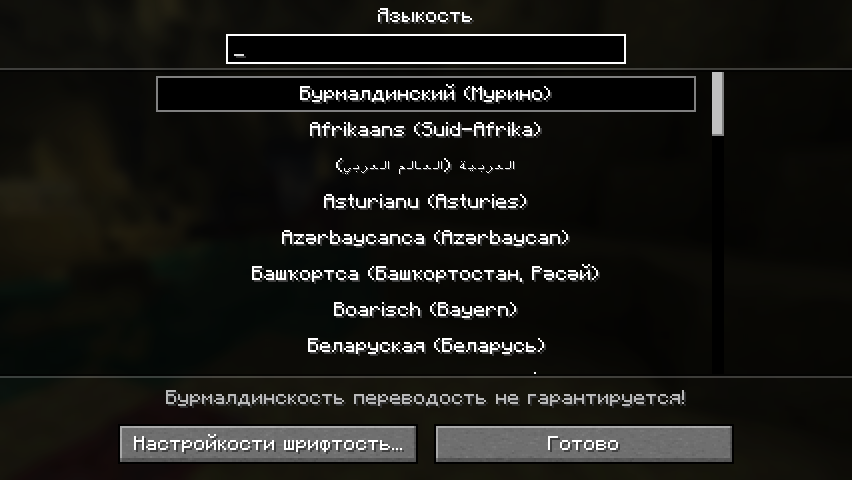
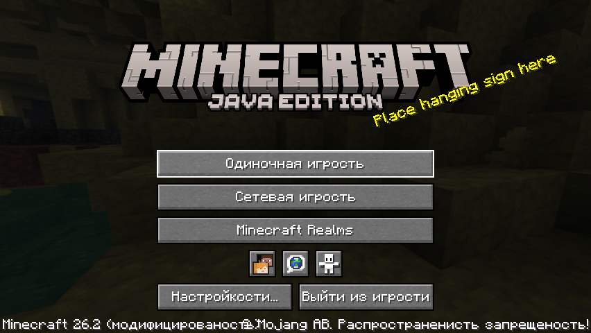
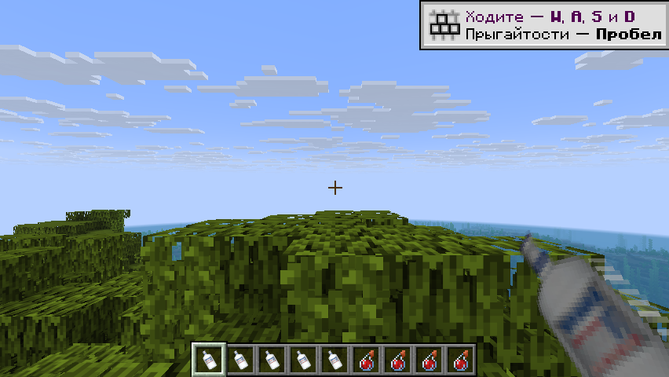

# Бурмалдинский язык (BurmaldynskyyLanguage)

Мод для **Minecraft 26.2 (Fabric)**, добавляющий в игру бурмалдинский язык.

Бурмалдинский — это русский, у которого все существительные получают окончание
**«-ость»** (или «-сть», если основа кончается на гласную), но при этом
сохраняют падеж:

> Ч вернулся домой и увидел свою **котость**, у **котости** был чёрный **хвостость**.

Язык выбирается в обычном меню **Настройки → Язык** и стоит там **первым в списке**.
Переводятся **все** строки игры, включая строки других модов, — мод берёт русский
перевод (`ru_ru`) и прогоняет его через морфологический движок прямо во время
загрузки ресурсов.






## Правила языка

| Правило | Пример |
| --- | --- |
| Существительное + «-ость» | `хвост` → `хвостость` |
| Основа на гласную → «-сть» | `расстояние` → `расстоянисть` |
| Падеж сохраняется (слово склоняется как «-ость») | `у кошки` → `у котости`, `с мечом` → `с мечостью` |
| Множественное число сохраняется | `с алмазами` → `с алмазостями` |
| Регистр сохраняется | `Кирка` → `Киркость`, `КИРКА` → `КИРКОСТЬ` |
| Глаголы, прилагательные, предлоги не трогаем | `Каменная кирка сломалась` → `Каменная киркость сломалась` |
| Плейсхолдеры и цветовые коды не трогаем | `§eПривет, %s!` → `§eПриветость, %s!` |

### Слова-исключения

| Русский | Бурмалдинский |
| --- | --- |
| я | ч |
| дед | дод |
| папа | батч |
| сын | сыр |
| жена | жинка |
| дочь | дотч |
| друзья | друны |

Исключения тоже склоняются: `с сыном` → `с сыром`, `к жене` → `к жинке`,
`с дочерью` → `с дотчем`, `у друзей` → `у друнов`.

## Чекушка

Зелье регенерации во всех трёх видах — обычное, взрывное и оседающее —
выглядит как чекушка, а не как ванильный пузырёк. Когда взрывная или
оседающая чекушка разбивается, вместо звона стекла раздаётся крик.



Всё остальное не трогается: остальные зелья выглядят и звучат как в ванили.
Опознание идёт по цвету эффекта регенерации, так что зелье из любого
источника — сваренное, из сундука, выданное командой — будет чекушкой.

## Музыка

Фоновая композиция Aria Math заменена: файл лежит по ванильному пути
`assets/minecraft/sounds/music/game/creative/aria_math.ogg` и перекрывает
оригинал. Остальные треки не трогаются.

## Установка

1. Fabric Loader **0.19.5+** для Minecraft **26.2** и Java **25**.
2. [Fabric API](https://modrinth.com/mod/fabric-api) для 26.2 — через него мод
   видит ресурсы других модов (словари и lang-файлы).
3. Положить `burmaldynskyy-language-1.0.0.jar` в папку `mods`.
4. Запустить игру, зайти в **Настройкости → Языкость** и выбрать
   **Бурмалдинский (Мурино)** — он первый в списке.

## API: как дописывать перевод

У мода два способа расширения — через Java и через обычные файлы ресурсов.
Оба нужны для одного и того же: поправить слово, которое движок разобрал
неправильно, или задать готовый перевод для конкретного ключа (например,
для предметов своего мода).

### 1. Через файл ресурсов (без кода)

Положите в свой мод или ресурспак файл
`assets/<ваш_namespace>/burmaldyn/dictionary.json`:

```json
{
  "words":             { "меню": "менюсть" },
  "stems":             { "кошк": "кот" },
  "exceptions":        { "жен": { "target": "жинк",
                                  "source_declension": "feminine",
                                  "target_declension": "feminine" } },
  "forced_nouns":      [ "кровать" ],
  "forced_noun_stems": [ "пчел" ],
  "skip":              [ "стив" ],
  "overrides":         { "item.mymod.wand": "Волшебная палкость" }
}
```

| Поле | Что делает |
| --- | --- |
| `words` | жёсткая замена конкретной словоформы |
| `stems` | подмена основы перед добавлением «-ость» |
| `exceptions` | замена слова целиком с сохранением падежа |
| `forced_nouns` | считать слово существительным, даже если движок решил иначе |
| `forced_noun_stems` | то же, но сразу для всех падежных форм основы |
| `skip` | никогда не переводить это слово |
| `overrides` | готовая строка для ключа локализации (автоперевод не применяется) |

Файлов может быть сколько угодно, имя любое — мод читает всё содержимое папки
`burmaldyn/`. Словари из ресурспаков применяются поверх словарей модов.

Второй способ без кода — обычный lang-файл
`assets/<ваш_namespace>/lang/brm_brm.json`. Он перекрывает автоперевод и
работает точно так же, как `ru_ru.json`.

### 2. Через Java

Добавьте точку входа в свой `fabric.mod.json`:

```json
"entrypoints": {
    "burmaldyn": ["com.example.MyBurmaldynAddon"]
},
"suggests": {
    "burmaldyn": "*"
}
```

```java
public class MyBurmaldynAddon implements BurmaldynExtension {
    @Override
    public void registerBurmaldyn(BurmaldynRegistry registry) {
        registry.override("item.mymod.magic_wand", "Волшебная палкость");
        registry.forcedNounStem("посох");
        registry.exception("брат", Declension.MASCULINE, "брот", Declension.MASCULINE);
        registry.postProcess(line -> line.replace("!", "!!"));
    }
}
```

Перевести строку вручную можно в любой момент:

```java
String text = BurmaldynApi.translate("Каменная кирка"); // Каменная киркость
String word = BurmaldynApi.translateWord("хвост");      // хвостость
```

Правила, добавленные через API, применяются при следующей перезагрузке
ресурсов (F3 + T или смена языка).

## Как это устроено

| Файл | Назначение |
| --- | --- |
| `engine/WordAnalyzer` | определяет, существительное ли это, и отрезает падежное окончание |
| `engine/Inflector` | ставит «-ость» в нужный падеж и склоняет слова-исключения |
| `engine/Lexicon` | стоп-списки: предлоги, местоимения, глагольные и прилагательные окончания |
| `engine/BurmaldynTranslator` | разбирает строку, не трогая `%s`, `§a` и латиницу |
| `mixin/LanguageManagerMixin` | добавляет язык в меню (первым) и подменяет перевод при загрузке ресурсов |
| `BurmaldynTranslations` | собирает итоговый словарь строк из трёх слоёв |

Морфология эвристическая: полноценного словаря русского языка в моде нет.
Спорные случаи трактуются в пользу «не трогать» — лучше оставить слово,
чем сломать строку. Всё, что разобрано неправильно, правится словарём.

## Сборка

Нужен JDK 25 (Minecraft 26.2 работает только на нём):

```bash
./gradlew build
```

Готовый мод — `build/libs/burmaldynskyy-language-1.0.0.jar`.

## Лицензия

GPL-3.0-or-later.
